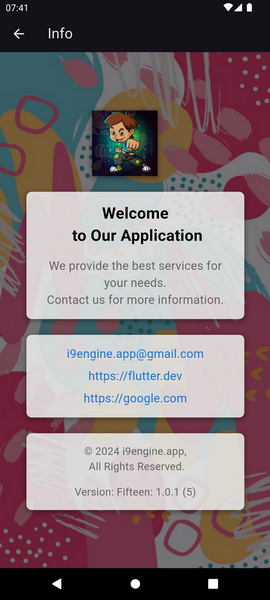

# Fifteen

i9engine.app@gmail.com

2024 (c) 

on Flutter!

A simple game for any age!

Has 3 difficulty levels. I have an opportunity:
1. Choose a light or dark theme. 2. Disable or enable sounds.
2. Select the language of communication.
3. You can create your own profile with an avatar and name.
4. It is possible to save and view game statistics.

Technologies used:
localizations, audio players,
firebase, firebase auth, firestore, firebase storage, firebase app check
image, path, connectivity
shared preferences, dotenv
provider, flutter bloc, equatable

//************************************************************************

Prosta gra dla każdego wieku!
Posiada 3 poziomy trudności. Mam okazję:
1. Wybierz jasny lub ciemny motyw. 2. Wyłącz lub włącz dźwięki.
2. Wybierz język komunikacji.
3. Możesz stworzyć swój własny profil z awatarem i nazwą.
4. Istnieje możliwość zapisywania i przeglądania statystyk gry.

Wykorzystane technologie:
lokalizacje, odtwarzacze audio,
Firebase, uwierzytelnianie Firebase, Firestore, przechowywanie Firebase, sprawdzanie aplikacji Firebase
obraz, ścieżka, łączność
wspólne preferencje, dotenv
dostawca, blok trzepotania, równy

//************************************************************************

Проста гра для будь-якого віку!
Має 3 рівні складності. Є можливість:
1. Вибрати світлу чи темну тему. 2. Вимкнути або увімкнути звуки.
2. Вибрати мову спілкування.
3. Можна створити свій профіль із аватаркою та ім'ям.
4. Є можливість збереження та перегляду статистики гри.

Використовувалися технології:
localizations, audioplayers,
firebase, firebase auth, firestore, firebase storage, firebase app check
image, path, connectivity
shared preferences, dotenv
provider, flutter bloc, equatable

//************************************************************************

Простая игра для любого возраста!
Имеет 3 уровня сложности. Есть возможность:
1. Выбрать светлую или темную тему. 2. Отключить или включить звуки.
2. Выбрать язык общения.
3. Можно создать свой профиль с аватаркой и именем.
4. Есть возможность сохранения и просмотра статистики игры.

Использовались технологии:
localizations, audioplayers, 
firebase, firebase auth, firestore, firebase storage, firebase app check
image, path, connectivity
shared preferences, dotenv
provider, flutter bloc, equatable

 
 
 
 
 
 
 
 
 
 
 
 
 

   

